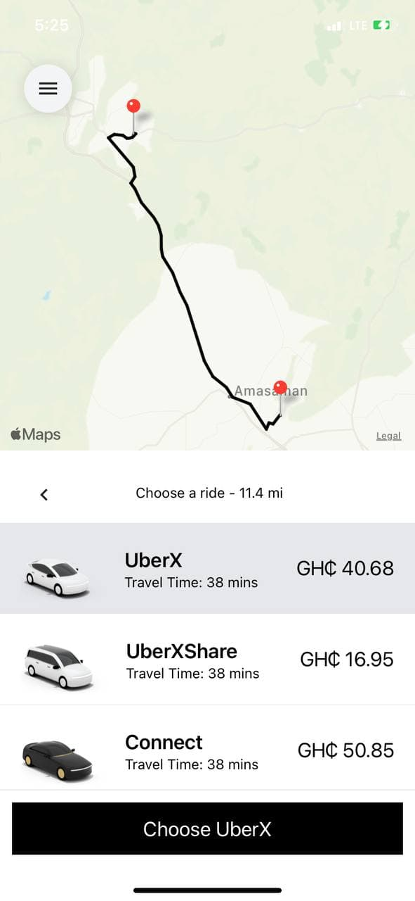

# Uber Clone
Creating an Uber Clone. V2.0
# Published Build:  DEMO

📝  Manifest: https://exp.host/@qbentil/uber-clone/index.exp?sdkVersion=44.0.0 
⚙️   Project page: https://expo.dev/@qbentil/uber-clone?serviceType=classic&distribution=expo-go 

    

# New Skills learnt from this tutorial.
1. React Redux (configuring store, reducrs and slices)
2. React Native Elements and Vector Icons
3. React native Safe Content
4. Style UI using TailWind React native class names.
5. React native Maps
6. React native maps direction
7. React Native Google Places AutoComplete 
8. Implemening Google Direction Matrix API
