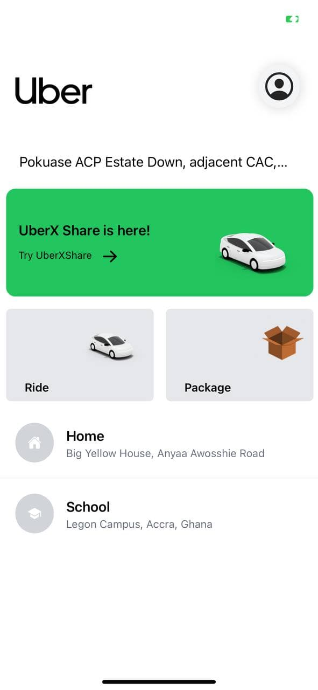
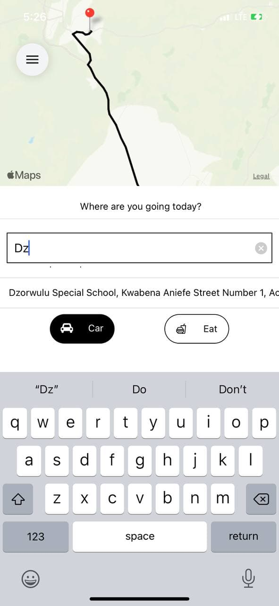
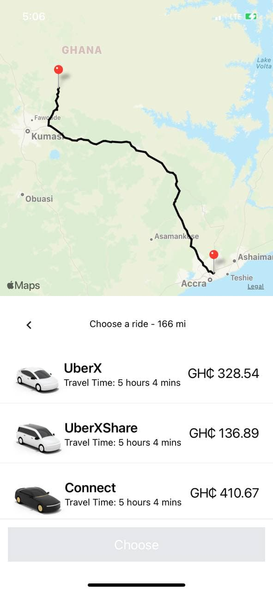
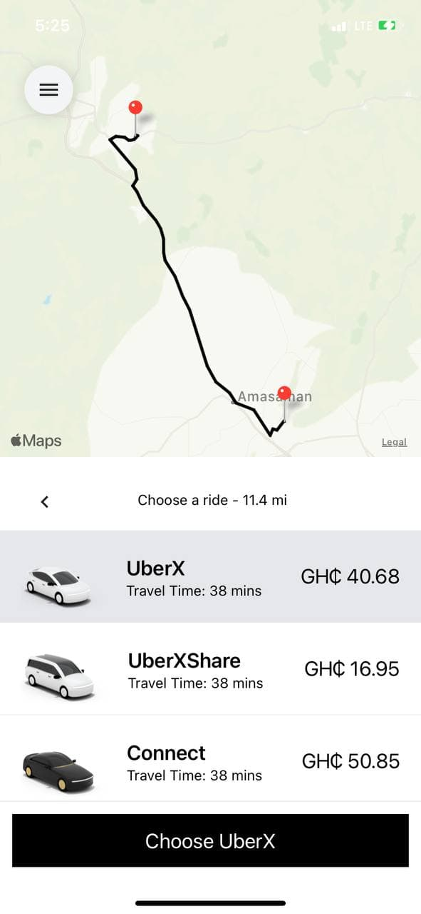

# Uber Clone
Creating an Uber Clone. V2.0
# Published Build:  DEMO

📝  Manifest: https://exp.host/@qbentil/uber-clone/index.exp?sdkVersion=44.0.0  
⚙️   Project page: https://expo.dev/@qbentil/uber-clone?serviceType=classic&distribution=expo-go 

    
    
    
    
    

This clone gives real time map directions using the google maps API abn also gives distances between Origin and dsetination with estimated cost using the Google Direction Matrix API. Users can also select any venue as thier destination from the List of places provided by Google Places Autocomplete.

# New Skills learnt from this tutorial.
1. React Redux (configuring store, reducrs and slices)
2. React Native Elements and Vector Icons
3. React native Safe Content
4. Style UI using TailWind React native class names.
5. React native Maps
6. React native maps direction
7. React Native Google Places AutoComplete 
8. Implemening Google Direction Matrix API

## **Comments**
It's a nice experience using REACT NATIVE TAILWIND CLASSNAME. 
It makes styling of the components much easier and faster. I will be using in my coming projects